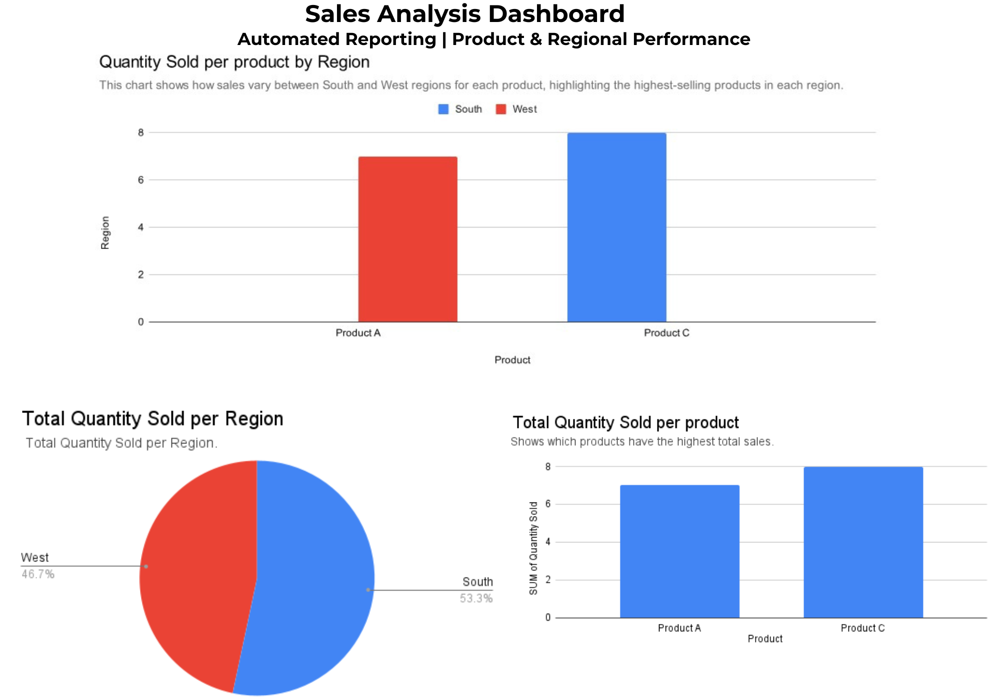

# Automated Sales Reporting Dashboard

## Project Overview
This project is an automated sales reporting dashboard built using Google Sheets. The dashboard analyzes sales performance by product and region and updates automatically when new data is added.

## Objectives
- Track product performance
- Track regional sales performance
- Automate reporting workflow
- Visualize sales data using charts

## Tools Used
- Google Sheets
- Pivot Tables
- Data Visualization
- Zapier (for automation)

## Dashboard Insights
- Product C has the highest sales overall
- The West region has slightly higher total sales than the South region
- Sales vary by product across regions

## Files in This Repository
- Sales_Data.csv: Raw sales data
- Reporting_Data.csv: Processed reporting data
- Sales_Dashboard.png: Final dashboard visualization

  ## Dashboard Preview
  
